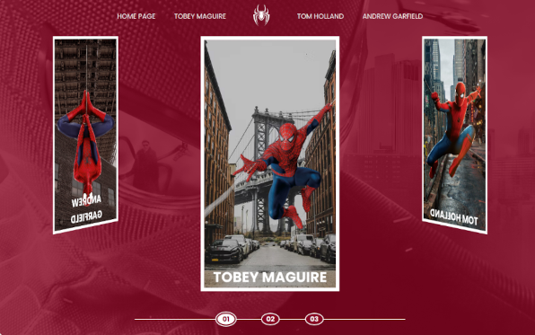

# Digital Innovation One - Spider-man Metaverse

This is a Project by Digital Innovation One [Spider-man Metaverso](https://web.dio.me/home).  

## Table of contents

- [Overview](#overview)
  - [Screenshot](#screenshot)
  - [Links](#links)
  - [Built with](#built-with)
  - [What I learned](#what-i-learned)
  - [Continued development](#continued-development)
- [Author](#author)

## Overview
  A static Web page about Spider-man series where you can see the films and trailers surfing on the spider web or through the carrousel.

### The challenge

Users should be able to:

- See hover states for all interactive elements on the page.
- Carrousel you can change the film.

### Screenshot

 

### Links

- Source code: [https://github.com/LuciMacedo/spiderman-application]
- Live Site URL: [Add live site URL here](https://spiderman-application-62ke.vercel.app/)

### Built with

- Semantic HTML5 markup
- CSS custom properties
- Flexbox
- JavaScript

### What I learned

While working through this project I learned more about how to manipulate DOM and rotateY, X, and Z.

### Continued development

Areas that I want to continue focusing on in future projects is JavaScript.  

## Author

- Website - [Luci](https://luci-webpage.vercel.app/)
- Dio - [Dio](https://web.dio.me/home)
- LinkedIn - [@lucimacedo](linkedin.com/in/lucimaramacedom)

